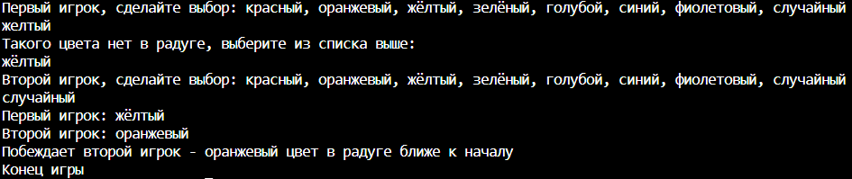
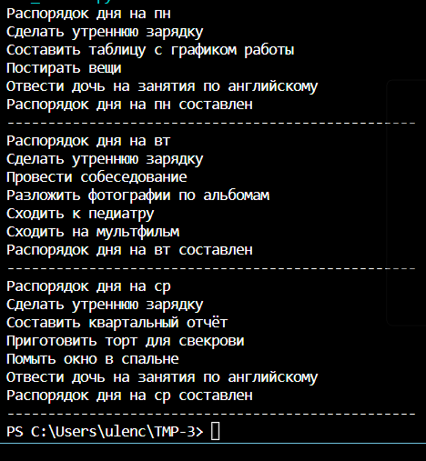

# Практическая работа №3. Поспелова Ульяна БИСО-03-20
## Стратегия
``` python
import random
from abc import ABC, abstractmethod

class Variant(ABC):
    @abstractmethod
    def selection(self) -> None:
        pass
class red(Variant):
    def selection(self) -> str:
        return "красный"
class orange(Variant):
    def selection(self) -> str:
        return "оранжевый"
class yellow(Variant):
    def selection(self) -> str:
        return "жёлтый"
class green(Variant):
    def selection(self) -> str:
        return "зелёный"
class azure(Variant):
    def selection(self) -> str:
        return "голубой"
class blue(Variant):
    def selection(self) -> str:
        return "синий"
class purple(Variant):
    def selection(self) -> str:
        return "фиолетовый"

class Random(Variant):
    def selection(self) -> str:
        options = ["красный", "оранжевый", "жёлтый", "зелёный", "голубой", "синий", "фиолетовый"]
        return random.choice(options)

class Game:
    strategy: Variant
    def __init__(self, strategy: Variant = None) -> None:
        if strategy is not None:
            self.strategy = strategy
        else:
            self.strategy = Random()
    def play(self, sec2) -> None:
        s1 = self.strategy.selection()
        s2 = sec2.strategy.selection()
        print("Первый игрок: {}".format(str(s1)))
        print("Второй игрок: {}".format(str(s2)))
        if s1 == s2:
            print("Ничья")
        elif s1 == "красный":
            print("Побеждает первый игрок - красный цвет в радуге ближе к началу")
        elif s1 == "оранжевый":
            if s2 == "красный":
                print("Побеждает второй игрок - красный цвет в радуге ближе к началу")
            else:
                print("Побеждает первый игрок - оранжевый цвет в радуге ближе к началу")
        elif s1 == "жёлтый":
            if s2 == "красный":
                print("Побеждает второй игрок - красный цвет в радуге ближе к началу")
            elif s2 == ("оранжевый"):
                print("Побеждает второй игрок - оранжевый цвет в радуге ближе к началу")
            else:
                print("Побеждает первый игрок - жёлтый цвет в радуге ближе к началу")
        elif s1 == "зелёный":
            if s2 == "красный":
                print("Побеждает второй игрок - красный цвет в радуге ближе к началу")
            elif s2 == ("оранжевый"):
                print("Побеждает второй игрок - оранжевый цвет в радуге ближе к началу")
            elif s2 == ("жёлтый"):
                print("Побеждает второй игрок - жёлтый цвет в радуге ближе к началу")
            else:
                print("Побеждает первый игрок - зелёный цвет в радуге ближе к началу")
        elif s1 == "голубой":
            if s2 == "красный":
                print("Побеждает второй игрок - красный цвет в радуге ближе к началу")
            elif s2 == ("оранжевый"):
                print("Побеждает второй игрок - оранжевый цвет в радуге ближе к началу")
            elif s2 == ("жёлтый"):
                print("Побеждает второй игрок - жёлтый цвет в радуге ближе к началу")
            elif s2 == ("зелёный"):
                print("Побеждает второй игрок - зелёный цвет в радуге ближе к началу")
            else:
                print("Побеждает первый игрок - голубой цвет в радуге ближе к началу")
        elif s1 == "синий":
            if s2 == "красный":
                print("Побеждает второй игрок - красный цвет в радуге ближе к началу")
            elif s2 == ("оранжевый"):
                print("Побеждает второй игрок - оранжевый цвет в радуге ближе к началу")
            elif s2 == ("жёлтый"):
                print("Побеждает второй игрок - жёлтый цвет в радуге ближе к началу")
            elif s2 == ("зелёный"):
                print("Побеждает второй игрок - зелёный цвет в радуге ближе к началу")
            elif s2 == ("голубой"):
                print("Побеждает второй игрок - голубой цвет в радуге ближе к началу")
            else:
                print("Побеждает первый игрок - синий цвет в радуге ближе к началу")
        elif s1 == "фиолетовый":
            if s2 == "красный":
                print("Побеждает второй игрок - красный цвет в радуге ближе к началу")
            elif s2 == ("оранжевый"):
                print("Побеждает второй игрок - оранжевый цвет в радуге ближе к началу")
            elif s2 == ("жёлтый"):
                print("Побеждает второй игрок - жёлтый цвет в радуге ближе к началу")
            elif s2 == ("зелёный"):
                print("Побеждает второй игрок - зелёный цвет в радуге ближе к началу")
            elif s2 == ("голубой"):
                print("Побеждает второй игрок - голубой цвет в радуге ближе к началу")
            elif s2 == ("синий"):
                print("Побеждает второй игрок - синий цвет в радуге ближе к началу")

def playtime(vibor):
    if vibor == "красный":
        return Game(red())
    elif vibor == "оранжевый":
        return Game(orange())
    elif vibor == "жёлтый":
        return Game(yellow())
    elif vibor == "зелёный":
        return Game(green())
    elif vibor == "голубой":
        return Game(azure())
    elif vibor == "синий":
        return Game(blue())
    elif vibor == "фиолетовый":
        return Game(purple())
    elif vibor == "случайный":
        return Game(Random())
print("Первый игрок, сделайте выбор: красный, оранжевый, жёлтый, зелёный, голубой, синий, фиолетовый, случайный")
vibor=input()
while vibor not in ("красный", "оранжевый", "жёлтый", "зелёный", "голубой", "синий", "фиолетовый", "случайный"):
    print("Такого цвета нет в радуге, выберите из списка выше:")
    vibor=input()
player1 = playtime(vibor)

print("Второй игрок, сделайте выбор: красный, оранжевый, жёлтый, зелёный, голубой, синий, фиолетовый, случайный")
vibor = input()
while vibor not in ("красный", "оранжевый", "жёлтый", "зелёный", "голубой", "синий", "фиолетовый", "случайный"):
    print("Такого цвета нет в радуге, выберите из списка выше:")
    vibor=input()
player2 = playtime(vibor)
player1.play(player2)
print("Конец игры")
```


## Шаблонный метод
``` python
from abc import ABC, abstractmethod

class Algorithm(ABC):

    def template_method(self):

        self.sport()
        self.work()
        self.home()
        self.child()
        self.final()
        self.printer()

    def sport(self):
        print("Сделать утреннюю зарядку")

    @abstractmethod
    def work(self):
        pass

    @abstractmethod
    def home(self):
        pass

    @abstractmethod
    def child(self):
        pass

    def final(self):
        print('Распорядок на три дня составлен')

    def printer(self):
        n = 50
        print("-" * n)
class menu:
    def table(self):
        print("Составить таблицу с графиком работы")

    def sobes(self):
        print("Провести собеседование")

    def otchet(self):
        print("Составить квартальный отчёт")

    def stirka(self):
        print("Постирать вещи")

    def photo(self):
        print("Разложить фотографии по альбомам")

    def english(self):
        print("Отвести дочь на занятия по английскому")

    def doctor(self):
        print("Сходить к педиатру")

    def cinema(self):
        print("Сходить на мультфильм")

    def cake(self):
        print("Приготовить торт для свекрови")

    def window(self):
        print("Помыть окно в спальне")

    def book(self):
        print("Почитать дочери сказку")

    def korp(self):
        print("Устроить корпоратив")

class Monday(Algorithm):
    def work(self):
        z = menu()
        z.table()

    def home(self):
        z = menu()
        z.stirka()

    def child(self):
        z = menu()
        z.english()

    def final(self):
        print('Распорядок дня на пн составлен')

class Tuesday(Algorithm):
    def work(self):
        z = menu()
        z.sobes()

    def home(self):
        z = menu()
        z.photo()

    def child(self):
        z = menu()
        z.doctor()
        z.cinema()

    def final(self):
        print('Распорядок дня на вт составлен')

class Wednesday(Algorithm):
    def work(self):
        z = menu()
        z.otchet()

    def home(self):
        z = menu()
        z.cake()
        z.window()

    def child(self):
        z = menu()
        z.english()

    def final(self):
        print('Распорядок дня на ср составлен')

print("Распорядок дня на пн")
a=Monday()
a.template_method()

print("Распорядок дня на вт")
b=Tuesday()
b.template_method()

print("Распорядок дня на ср")
c=Wednesday()
c.template_method()
```
