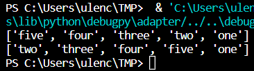
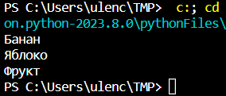

# Практическая работа №4. Поспелова Ульяна БИСО-03-20

## Итератор

``` python
class IteratorBase(object):
    """Итератор"""
    def first(self):
        raise NotImplementedError()
 
    def last(self):
        raise NotImplementedError()
 
    def next(self):
        raise NotImplementedError()
 
    def prev(self):
        raise NotImplementedError()
 
    def current_item(self):
        raise NotImplementedError()
 
    def is_done(self, index):
        raise NotImplementedError()
 
    def get_item(self, index):
        raise NotImplementedError()
 
class Iterator(IteratorBase):
    def __init__(self, list_=None):
        self._list = list_ or []
        self._current = 0
 
    def first(self):
        return self._list[0]
 
    def last(self):
        return self._list[-1]
 
    def current_item(self):
        return self._list[self._current]
 
    def is_done(self, index):
        last_index = len(self._list) - 1
        return 0 <= index <= last_index
 
    def next(self):
        self._current += 1
        if not self.is_done(self._current):
            self._current = 0
        return self.current_item()
 
    def prev(self):
        self._current -= 1
        if not self.is_done(self._current):
            self._current = len(self._list) - 1
        return self.current_item()
 
    def get_item(self, index):
        if not self.is_done(index):
            raise IndexError('Нет элемента с индексом: %d' % index)
        return self._list[index]
 
it = Iterator(('one', 'two', 'three', 'four', 'five'))
print ([it.prev() for i in range(5)])
print ([it.next() for i in range(5)])
```



## Посетитель

``` python
class FruitsVisitor(object):
    """Посетитель"""
    def draw(self, fruits):
        methods = {
            Banana: self.draw_banana,
            Apple: self.draw_apple,
        }
        draw = methods.get(type(fruits), self.draw_unknown)
        draw(fruits)
 
    def draw_banana(self, fruits):
        print ('Банан')
 
    def draw_apple(self, fruits):
        print ('Яблоко')
 
    def draw_unknown(self, fruits):
        print ('Фрукт')
 
class Fruits(object):
    def draw(self, visitor):
        visitor.draw(self)
 
class Banana(Fruits):
    """Банан"""
 
class Apple(Fruits):
    """Яблоко"""
 
class Orange(Fruits):
    """Апельсин"""
 
visitor = FruitsVisitor()
 
banana = Banana()
banana.draw(visitor)
 
apple = Apple()
apple.draw(visitor)
 
orange = Orange()
orange.draw(visitor)
```

