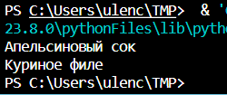
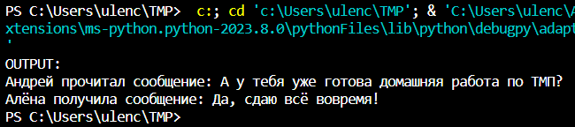
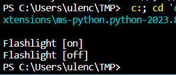
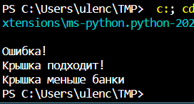

# Практическая работа №5. Поспелова Ульяна БИСО-03-20

## Абстрактная фабрика

``` python
class AbstractFactory(object):

    def create_drink(self):
        raise NotImplementedError()
    
    def create_food(self):
        raise NotImplementedError()
    
class Drink(object):
    def __init__(self, name):
        self._name = name
    
    def __str__(self):
        return self._name
    
class Food(object):
    def __init__(self, name):
        self._name = name
    
    def __str__(self):
        return self._name
    
class ConcreteFactory1(AbstractFactory):
    def create_drink(self):
        return Drink('Апельсиновый сок')
    
    def create_food(self):
        return Food('Куриное филе')
    
class ConcreteFactory2(AbstractFactory):
    def create_drink(self):
        return Drink('Холодный чай')
   
    def create_food(self):
        return Food('Лазанья')
    
def get_factory(ident):
    if ident == 0:
        return ConcreteFactory1()
    elif ident == 1:
        return ConcreteFactory2()
    
factory = get_factory(0)
print (factory.create_drink()) 
print (factory.create_food())
```



## Посредник

``` python
from abc import ABCMeta, abstractmethod
from weakref import proxy
import inspect


class Mediator(metaclass=ABCMeta):
	@abstractmethod
	def send(self, message: str) -> None:
		pass


class Colleague(metaclass=ABCMeta):
	def __init__(self, mediator: Mediator) -> None:
		self._mediator = proxy(mediator)

	@abstractmethod
	def send(self, message: str) -> None:
		pass

	@abstractmethod
	def receive(self, message: str) -> None:
		pass


class TelegramBetweenTwoColleagues(Mediator):
	def __init__(self) -> None:
		self._first = None
		self._second = None

	def set_first(self, first: Colleague) -> None:
		self._first = first

	def set_second(self, second: Colleague) -> None:
		self._second = second

	def send(self, message: str) -> None:
		sender = inspect.currentframe().f_back.f_locals['self']
		receiver = self._first if sender == self._second else self._second
		receiver.receive(message)


class Alyona(Colleague):

	def send(self, message: str) -> None:
		self._mediator.send(message)

	def receive(self, message: str) -> None:
		print('Алёна получила сообщение: {}'.format(message))


class Andrey(Colleague):

	def send(self, message: str) -> None:
		self._mediator.send(message)

	def receive(self, message: str) -> None:
		print('Андрей прочитал сообщение: {}'.format(message))


if __name__ == '__main__':
	print('OUTPUT:')
	telegram = TelegramBetweenTwoColleagues()
	alyona = Alyona(telegram)
	andrey = Andrey(telegram)
	telegram.set_first(alyona)
	telegram.set_second(andrey)
	alyona.send('А у тебя уже готова домашняя работа по ТМП?')
	andrey.send('Да, сдаю всё вовремя!')
```



## Строитель

``` python
class Builder(object):
    def build_body(self):
        raise NotImplementedError()
 
    def build_lamp(self):
        raise NotImplementedError()
 
    def build_battery(self):
        raise NotImplementedError()
 
    def create_flashlight(self):
        raise NotImplementedError()
 
class Flashlight(object):
    def __init__(self, body, lamp, battery):
        self._shine = False  # излучать свет
        self._body = body
        self._lamp = lamp
        self._battery = battery
 
    def on(self):
        self._shine = True
 
    def off(self):
        self._shine = False
 
    def __str__(self):
        shine = 'on' if self._shine else 'off'
        return 'Flashlight [%s]' % shine
 
class Lamp(object):
    """Лампочка"""
 
class Body(object):
    """Корпус"""
 
class Battery(object):
    """Батарея"""
 
class FlashlightBuilder(Builder):
    def build_body(self):
        return Body()
 
    def build_battery(self):
        return Battery()
 
    def build_lamp(self):
        return Lamp()
 
    def create_flashlight(self):
        body = self.build_body()
        lamp = self.build_lamp()
        battery = self.build_battery()
        return Flashlight(body, lamp, battery)
 
builder = FlashlightBuilder()
flashlight = builder.create_flashlight()
flashlight.on()
print (flashlight)
flashlight.off()
print(flashlight)
```



## Адаптер

``` python
import math
 
class HoleInToe(object):
    def __init__(self, r):
        self.r = r
 
    def put(self, obj):
        try:
            if self.r >= obj.r:
                print (u'Крышка подходит!')
            else:
                print (u'Крышка меньше банки')
        except AttributeError:
            print (u'Ошибка!')
 
class Patch(object):
    def __init__(self, x, h):
        self.x = x
        self.h = h
 
class SquareHoleAdapter(object):
    def __init__(self, sq_obj):
        self.sq_obj = sq_obj
 
    @property
    def r(self):
        return math.sqrt(2*(self.sq_obj.x**2))/2
 
h1 = HoleInToe(5)
h2 = HoleInToe(2)
s1 = Patch(5, 7)
s2 = Patch(3, 3)
sa = SquareHoleAdapter(s2)
 
h1.put(s1)

h1.put(sa)

h2.put(sa)
```

