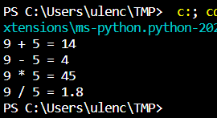
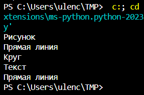
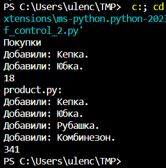

# Практическая работа №6. Поспелова Ульяна БИСО-03-20

## Заместитель

``` python
class IMath:
    def add(self, x, y):
        raise NotImplementedError()

    def sub(self, x, y):
        raise NotImplementedError()

    def mul(self, x, y):
        raise NotImplementedError()

    def div(self, x, y):
        raise NotImplementedError()

class Math(IMath):
    def add(self, x, y):
        return x + y

    def sub(self, x, y):
        return x - y

    def mul(self, x, y):
        return x * y

    def div(self, x, y):
        return x / y

class Proxy(IMath):

    def __init__(self):
        self.math = Math()

    def add(self, x, y):
        return x + y

    def sub(self, x, y):
        return x - y

    def mul(self, x, y):
        return self.math.mul(x, y)

    def div(self, x, y):
        return float('inf') if y == 0 else self.math.div(x, y) 

p = Proxy()
x, y = 9, 5
print ('9 + 5 = ' + str(p.add(x, y)))
print ('9 - 5 = ' + str(p.sub(x, y)))
print ('9 * 5 = ' + str(p.mul(x, y)))
print ('9 / 5 = ' + str(p.div(x, y)))
```



## Компоновщик

``` python
class Graphic(object):
    def draw(self):
        raise NotImplementedError()
 
    def add(self, obj):
        raise NotImplementedError()
 
    def remove(self, obj):
        raise NotImplementedError()
 
    def get_child(self, index):
        raise NotImplementedError()
 
 
class Line(Graphic):
    def draw(self):
        print ('Прямая линия')
 
 
class Circle(Graphic):
    def draw(self):
        print ('Круг')
 
 
class Text(Graphic):
    def draw(self):
        print ('Текст')
 
 
class Picture(Graphic):
    def __init__(self):
        self._children = []
 
    def draw(self):
        print ('Рисунок')
        for obj in self._children:
            obj.draw()
 
    def add(self, obj):
        if isinstance(obj, Graphic) and not obj in self._children:
            self._children.append(obj)
 
    def remove(self, obj):
        index = self._children.index(obj)
        del self._children[index]
 
    def get_child(self, index):
        return self._children[index]
 
 
pic = Picture()
pic.add(Line())
pic.add(Circle())
pic.add(Text())
pic.draw()
 
line = pic.get_child(0)
line.draw()
```



## Инверсия управления

``` python
print("Покупки")

product = []
numbers=[]
def add_c():
    for person in product:
        print(f"Добавили: {person}.")

def calculation(sum=0):
    for num in numbers:
        sum=num+sum
    print(sum)


product.append("Кепка")
product.append("Юбка")
add_c()

numbers.append(10)
numbers.append(8)
calculation()
```

``` python
from inversion_of_control_1 import * 

print("product.py:")

product.append("Рубашка")
product.append("Комбинезон")

numbers.append(248)
numbers.append(75)

add_c()
calculation()

```


